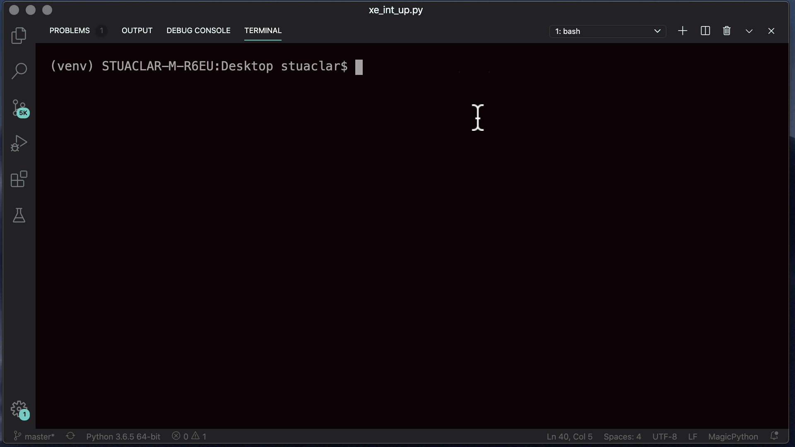

# Using RESTCONF to enable an interface on IOS XE

This public repo contains python code that can be used to interact with the `Cisco IOS XE API`. The environment is pre-configured to access the [IOS XE on CSR Recommended Code Always On Sandbox](https://devnetsandbox.cisco.com/RM/Diagram/Index/27d9747a-db48-4565-8d44-df318fce37ad?diagramType=Topology) device .You can edit the variables in the environment to point to your own IOS XE device. The code contains REST API calls to authenticate, and bring up an interface.


## Python Environment Setup
It is recommended that this code be used with Python 3.6. It is highly recommended to leverage Python Virtual Environments (venv).
Follow these steps to clone the code and create and activate a venv.

```
git clone https://github.com/bigevilbeard/Interface_Up_Restconf.git
cd Interface_Up_Restconf
```


## OS X or Linux
```
virtualenv venv --python=python3.6
source venv/bin/activate
```
## Install the code requirements
```
pip install -r requirements.txt
```

## Python’s Requests Library

The requests library is the de facto standard for making HTTP requests in Python. It abstracts the complexities of making requests behind a beautiful, simple API so that you can focus on interacting with services and consuming data.

## Information About RESTCONF Programmable Interface

### Overview of RESTCONF
This section describes the protocols and modelling languages that enable a programmatic way of writing configurations to a network device.

- RESTCONF—Uses structured data (XML or JSON) and YANG to provide a REST-like APIs, enabling you to programmatically access different network devices. RESTCONF APIs use HTTPs methods
- YANG—A data modelling language that is used to model configuration and operational features . YANG determines the scope and the kind of functions that can be performed by NETCONF and RESTCONF APIs

## PUT Request to Shutdown Interface

- Send PUT request to issue `no shutdown` on GigabitEthernet2
- Method: PUT
- Request URL:  `https://{h}:{p}/restconf/data/ietf-interfaces:interfaces`
- PUT Request Payload:

```
{
   "ietf-interfaces:interface":{
      "name":"GigabitEthernet2",
      "description":"Configured by RESTCONF",
      "type":"iana-if-type:ethernetCsmacd",
      "enabled":true
   }
}
```

The payload can also be changed to `"enabled": false` to shutdown GigabitEthernet2.

## GET Request to Validate Changes

- Send GET request to issue output on GigabitEthernet2
- Method: GET
- Request URL:  `https://{h}:{p}/restconf/data/ietf-interfaces:interfaces`
- GET Request Payload: N/A

Responce is printed using Python f-strings. Also called “formatted string literals,” f-strings are string literals that have an f at the beginning and curly braces containing expressions that will be replaced with their values. The expressions are evaluated at runtime and then formatted using the __format__ protocol.

```
for key, value in jsonResponse.items():
    print(f'Interface Name: {jsonResponse["ietf-interfaces:interface"]["name"]}')
    print(f'Interface Description: {jsonResponse["ietf-interfaces:interface"]["description"]}')
    print(f'Interface Status: {jsonResponse["ietf-interfaces:interface"]["enabled"]}')
```

## Example Output




## About me

Network Automation Developer Advocate for Cisco DevNet.
I'm like Hugh Hefner... minus the mansion, the exotic cars, the girls, the magazine and the money. So basically, I have a robe.

Find me here: [LinkedIn](https://www.linkedin.com/in/stuarteclark/) / [Twitter](https://twitter.com/bigevilbeard)

